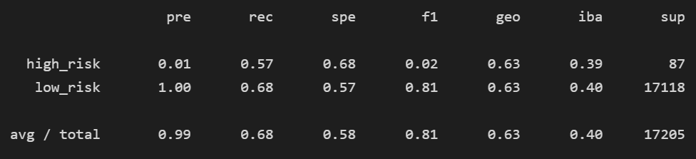
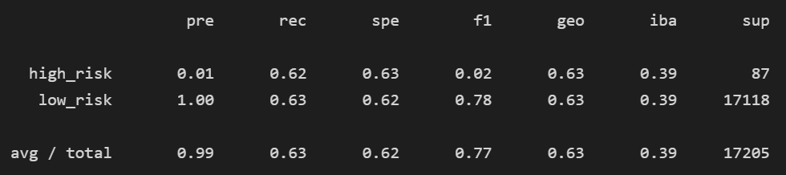
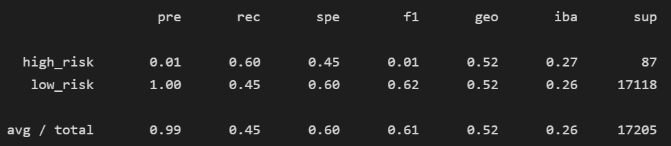
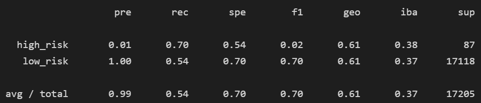
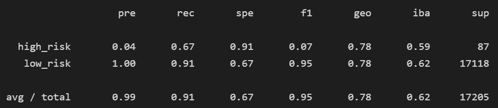
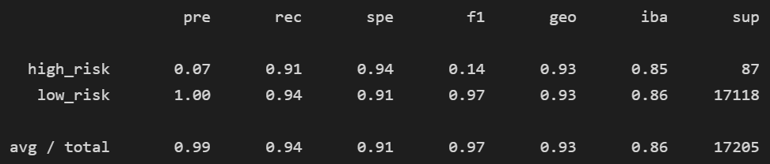

# Credit Risk Analysis
## Overview
We use Supervised Learning to predict credit risk. For this module we used Python, SKLearn, and Imbalance Learn.

## Results
### Naive Random Oversampling

  - Accuracy : 68.35%

### SMOTE Oversampling

  - Accuracy : 62.77%

### Undersampling

  - Accuracy : 52.23%

### Combination (Over and Under) Sampling

  - Accuracy : 61.97%

### Balanced Random Forest Classifier

  - Accuracy : 78.78%

### Ada Boost Classifier

  - Accuracy : 92.54%

## Summary
Based on the results that we got, the Ada Boost Classifier is the best model to use for the credit risk analysis because of the 92% Accuracy score. 
Summarize the results of the machine learning models, and include a recommendation on the model to use, if any. If you do not recommend any of the models, justify your reasoning. 
